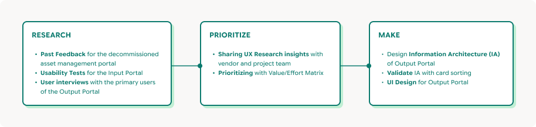
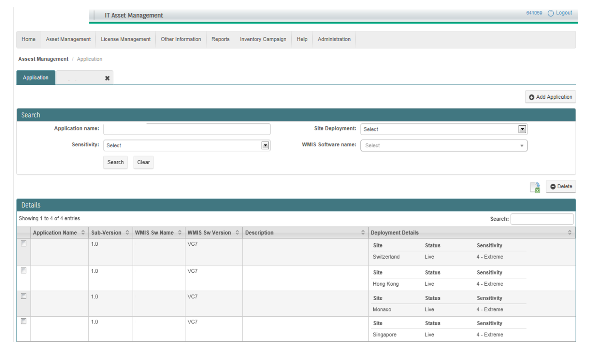
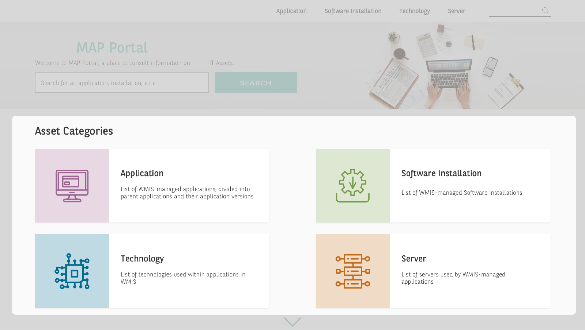
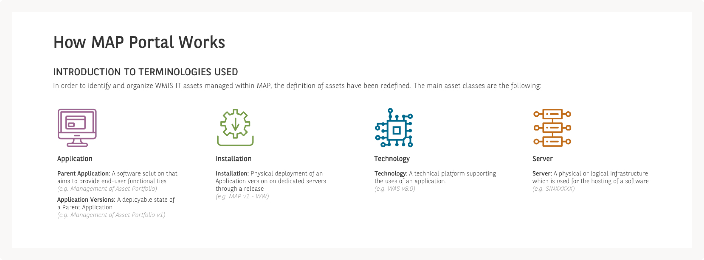
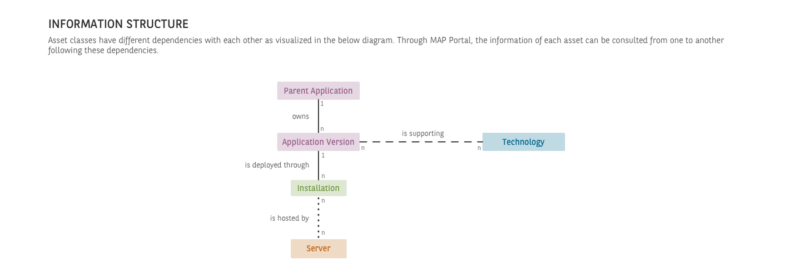
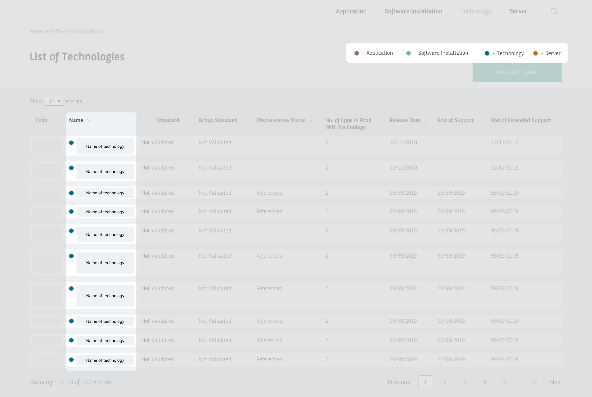
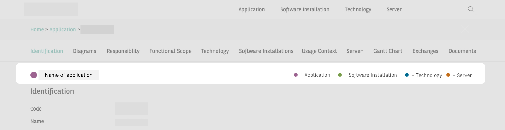
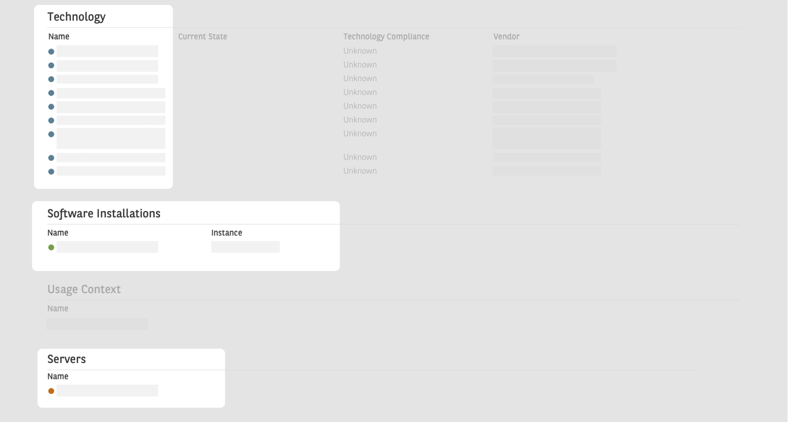

## Overview

The client, a leading European bank, purchased a vendor tool to replace its internal IT asset management portal. The vendor tool is a **two part solution** that includes an **input portal** *(for information input on the assets only available for specific members in the organization)*, and an **output portal** *(a website for viewing the list of assets which is accessible by the whole organization)*.

I was the **lead UX Designer** and **Researcher** for this project, and I was initially tasked by management to **evaluate** the vendor tool for any **usability issues** and resolve these issues with the vendor. However due to limitations on the vendor’s end, no changes could be made on the web application and only the web portal was fully customizable. Hence, I **pivoted** to doing **research** and **design** for only the **web portal** in the second part of this project.

## Outcomes

- **Output Portal** received **positive feedback** from **new joiners** as it made it **easy** for them to catch up on application dependencies during **onboarding**
- The situation with us not being able to redesign the web application to improve its UX prompted conversations between the UX team and management about **involving UX evaluation earlier in procurement decisions**

## Challenges

- The **vendor tool was already procured** before I started evaluating its usability. Thus, even though critical usability issues were discovered, the **vendor was did not want to make any improvements** to their tool as we had no contractual leverage. The vendor also had no obligation to make those changes without an extra charge.
- The vendor was **not receptive** to having their product evaluated. **Managing** their **defensive reaction** towards the usability test results while **maintaining** a **positive working relationship** with the vendor and project team throughout the process was one of the hardest challenges I navigated in this project.
- **Getting budget approved for UX Research** was a constant negotiation as it was the first time where the project team and the vendor had worked with UX Designers and I had to provide a lot of justification why doing UX Research is important

## Approach

Over the course of 5 months, I went through a rigorous design process that involves:

- Conducting user interviews with members from the primary user groups that will be using
- Running usability tests on the vendor's product with primary users
- Stakeholder Management between the design team, vendor team, project team, and the users
- Designing of the Web Application that enables users to view the list of IT assets used by the organization

This is the detailed design process we defined together with the project team:

### Research

In order to have a better understanding of our users’ needs and goals, I gathered quantitative and qualitative data and feedback from the users via the following channels:

1. **Feedback** for the **decommissioned asset management portal** documented by the previous project team
2. Conducting **Usability Tests** on the vendor’s solution for the input portal
3. Conducting U**ser Interviews** to gather user expectations for the output portal

We gathered the following insights on users’ needs and pain points from the research done:

<aside>
<h4>Users' needs</h4>

- Having a **central repository** of application-related information
- **Improve ease of finding information** through:
    - **Simple** and **clear** **presentation** of information
    - Ability to **search by different categories** of information
    - Clearer **naming conventions** that are understood organization-wide
</aside>

<aside>
<h4>Users' Pain Points</h4>

- **Human Dependency:** For getting access to information, and to locate information within the organization
- **Confusion with terminology used:** There is a lack of common understanding of certain terminologies in the organization. (e.g. Everyone has a different understanding of what a “technology” means)
- **Navigation and findability problems:** Caused by the confusion with the terminologies used in navigation menus, and search terms not matching with terms used in the application and portal
- **Search Friction:** Both the old and new platform took too many clicks to get users to what they wanted to find
</aside>

### Sharing UX Research Analysis with stakeholders, and prioritization exercise

I then presented our findings from our UX research analysis to stakeholders from the vendor team and project team, and we conducted a **prioritization** exercise using a **Rewards / Efforts Matrix.**

For the **input portal**, as it is an out-of-the-box solution, the pain points of the users were unable to be addressed through UI improvements due to the limitations from the vendor.

For the **output portal**, users' needs were made known to the project team. Features that users needed will be rolled on in future phases of the project.

A **card sorting** exercise was also done with subject matter experts to identify an **information architecture** for the Web Portal, and to also **ensure** that the **terminologies** used in the Output Portal are **commonly known**.

## Final UI Design

Combining the insights gathered from the users in the initial research phase, as well as the prioritised features that we have identified from the value proposition canvas, I kept the following points in mind while designing:

<aside>
✅ **Points to be addressed through designs:**

- Ability to search by different categories of information
- Standardize naming conventions and terminologies
- Clearer information structure
</aside>

### Old Output Portal

### New Output Portal

#### 1. Ability to search by different categories of information

Apart from the global search, users are now able to search by different asset categories. Asset categories are **color coded**, and a **short description** of that category is added below to give users more context to help them make a more informed navigation choice.

#### 2. Standardized Naming Conventions and Terminologies

An introduction to all the terminologies used in the portal is provided on the portal’s home page. Examples are given as well to guide the user in their search process.

#### 3. Clearer information structure

There is now more explanation on the output portal’s homepage to inform users how this. portal can be used, and the different types of asset categories that are available and how they are structured. This section will be especially helpful for future newcomers who have yet to learn how certain terminologies are used in the organization.

#### 4. Other tools to help users find information

**Color codes** for different asset types are shown on all the screens as a legend, to help users identify the asset category faster and easier. This **color segmentation** is **crucial** as **some applications and technologies have the same names**, and users could not tell them apart at first glance in the old portal.

Whenever an asset is named within a portal’s page, its **asset category’s color code will always appear next to its name** for the users to easily identify whether that is the name of an application, software installation, technology or server. The examples below are taken from a page describing the specifications of an application.

## Impact

After the output portal was launched, I received **positive feedback** from coworkers who are **new joiners** of the organization. My coworkers mentioned that the **explanations of the various terminologies** and **information structure diagrams** on the portal’s homepage **helped them greatly with their onboarding process**, and got them up to speed with the understanding they needed to have of the applications they would be working with.

## Reflections

This was one of the biggest projects I have handled, and made me grow and mature not only as a UX Designer, but also as a working professional. It was very challenging to not only work on a tight budget and timeline, but also with a project team who was not used to placing user experience as one of their main priorities.

**Stakeholder management** was also not an easy task as the project team and vendor team had no prior exposure to user experience design. I faced a lot of pushback and friction at the beginning as the vendor did not feel good having us evaluate their solution. I managed to overcome the frustrations by **displaying empathy to my project team** whenever there was friction. I always made sure to **listen to my teammates’ concerns first before voicing mine**, and then we would work towards **finding a middle ground** that would serve both of our needs as much as possible. It took a while to earn their trust, but eventually my **teammates reciprocated with empathy** as well. That **drastically improved our working relationship**, and this is where I learnt the importance of having empathy for not only our users, but for our co-workers too.

#### What I could’ve done better

I would have liked to **further segment the user groups** for the output portal as I wanted to test the assumption that **different roles had different use cases** for it. However, it was a **challenge** to convince the project team to do that segmentation as the **priority** for this project was the **input portal** as its users were managers that had higher expectations for this tool. Additionally, there was a **tight timeline** and **budget** set by the management. Thus, we had to move on to gather our users’ needs and goals generically without dissecting the different user groups for the output portal.

More **extensive research** on **various category headers and row labels** within the output portal also needs to be done to ensure that the terminologies used are understood by everyone in the organization. I would have liked to conduct further **usability tests**, **card sorting** and **tree testing** exercises to validate my designs.

I felt that it was a good strategy to put in explainers on the portal’s home page to educate users to reduce the learning curve. However, it would be helpful to **test if those explainers are effective in educating as well**.