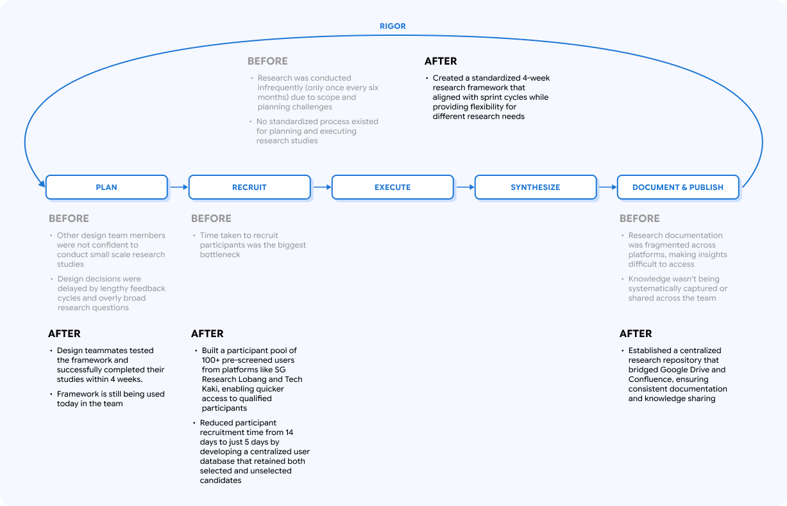

# Overview

**SearchSG** is the Singapore government’s Search-as-a-service technology stack. It is built for all Singaporeans to find any government content efficiently and effectively, and for government agencies to track and improve their website’s search experiences through meaningful search insights provided. 

As the **sole UX researcher** at SearchSG, I identified significant **gaps in our research processes, rigor** and **documentation**, then **implemented comprehensive solutions** that **transformed** how our team **conducts user research**.

# Outcomes

- **Increased research frequency** **from bi-annual to quarterly** studies, with smaller feature-specific surveys using the government’s survey platform, Crowdtask. Contributing factors include resolving participant recruitment bottleneck, standardization of research process and tighter scoping of research objectives
- Improved **findability** of past research insights through **establishing a centralized research repository** on Confluence

# Challenges

Within the first 8 months of conducting research activities in SearchSG, I collected all the pain points I faced while going through the research process, and feedback from what other stakeholders (e.g. the rest of the UX team, product team) felt about the state of research activities.

<aside>

 **Research Process:**

- No standardized workflow
- Participant recruitment took at least 2 weeks, with no retained participant pool
- Poor scope definition caused studies to take 2 to 3 months to conclude, resulting in research studies only happening twice a year thus far
</aside>

<aside>

 **UX Team:**

- Research felt daunting and tiring with an ambitious scope
- Other team members had no structured way to run studies and relied heavily on me, the sole UX Researcher
</aside>

<aside>

 **Project Manager:**

- Had no visibility on what the research process looked like. There was no standards defined for how long research studies will take, and when insights would be ready.
</aside>

<aside>

 **Research Documentation:**

- Insights were documented in decks, so the UX team has to look through multiple decks to locate the insight they want
- UX team will just tell me to locate these insights most of the time, adding on to more tasks to do on my plate
</aside>

# Goals

I envisioned the future state of research operations in SearchSG to encompass these three areas, and used them as my north star when building my approach:

- Ensuring research studies are rigorous and focused
- Increase frequency of research studies
- Make research insights and documentation easier to locate

# 🛠️ Approach

<aside>
❗

Deliverables cannot be publicly displayed due to confidentiality agreements with the client. However, I'd be happy to show and walk through it during interviews.

</aside>

### 1. Resolve the greatest bottleneck: Participant Recruitment Duration

One of our biggest challenges was participant recruitment, which frequently took up to 14 days and delayed critical user feedback. To address this, I established a **comprehensive UX Research User Database** for SearchSG that:

- **Stored both selected and unselected participants** in a **repository** from a previous recruitment cycle *(100+ sign-ups)* that we sourced from SG Research Lobang *(a local Telegram channel to seek out participants for research studies)* and Tech Kaki *(a GOVTECH community of volunteers who participate regularly in government technology research studies)*
- **Captured detailed screener responses** about **search behaviors** and **website preferences**
- Added **timestamps** when participant data is input to resolve a critical issue with age data, ensuring **accurate demographic classification**
- **Implemented tracking** for participation history, blacklisted participants, and participants’ responsiveness

### 2. Develop a structured research process that is easily repeatable

I created a **repeatable, 4-week qualitative research workflow** that:

- **Aligned** with the **team's sprint cycles** to ensure timely delivery of insights
- Provided **clear instructions** through each stage of a research study
- Included **embedded instructions** to **support team members new to research**
- Introduced a **rating system** to help with prioritizing research objectives for better research scope management
- Proposed **smaller, targeted studies** using the government survey platform for feature-specific feedback

This workflow was **documented as a reusable template on Confluence** that team members could duplicate and adapt for their own research planning.

### 3. Establish a Unified Research Repository

I created a **centralized repository** for managing research assets on Confluence that:

- **Standardized** the **format** and **storage** of research plans, data, and findings
- **Curated a research best practices library** for team members to quickly adopt proven methodologies
- Bridged the gap between our team's Google Drive usage and the company's Confluence adoption
- Made it easier to reference past insights and build on existing knowledge
- **Reduced duplication of effort** across team members and projects

# Impact

After the research workflow and repository were set up, we put it to the test for 3 months before I left the team at the end July 2023 for my masters in the US. During that period, I was asked to conduct an A/B test with a government agency evaluating a potential onboarding with SearchSG, and another usability test for AI features. A UX Teammate also used the framework to conduct her own feature research on the government survey platform, Crowdtask.

We noticed the following results:

- **Participant recruitment time dropped** from a minimum of 14 days to 5 days.
- Timeboxing and scope management **helped us to juggle multiple large-scale research studies** that were ongoing (A/B Testing, Usability Test)
- A **UX Team mate successfully completed her first research study** on Crowdtask with minimal guidance, and was able to get valuable feedback on the feature she was designing

**Research** felt **less daunting** and **tiring** across the team, as the design team felt more **confident** to plan and execute studies independently, and studies no longer run indefinitely because of a **better managed research scope**. Having a defined research workflow also improved my working relationship with my project manager as he now has **better visibility** into the research process and study duration, so it gives him a better idea of my capacity and deliverables.

As the sole UX Researcher, I could also dedicate more time to larger research studies that would have better ROI for the team, and **mentor** my teammates in their UX research skills.

The research workflow and repository is **still being used** in SearchSG today, as of April 2026.

# Reflections

Setting up Research Ops in SearchSG was my last “gift” to the team as it served as not only a knowledge transfer to prepare for my departure, but also I wanted it to be a “gift that keeps on giving” that would benefit the team for years to come. Basically, a workflow that empowers my teammates who are all new to UX Research and would like to learn it, and a repository to store and share the fruits of our labor on the search-related research we have done so far.

I have contemplated using Airtable to set up the workflow and repository. However, the research insights decks were saved on Google Drive, and the team wanted to move the source of truth to be solely on Confluence. Hence, there was no appetite to add a third platform on top of everything else.

Research slowed down after I left, but that had more to do with the team winding down on feature development than anything in the process. The repository is still being accessed, though it has not been updated with the research work done since I left. What I would have done differently would be to set up a more robust governance for the research repository, that includes an easier way to maintain and update the repository, and the ownership of the research repository.
