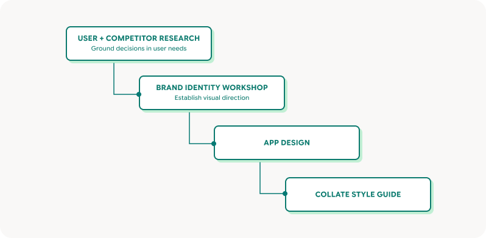
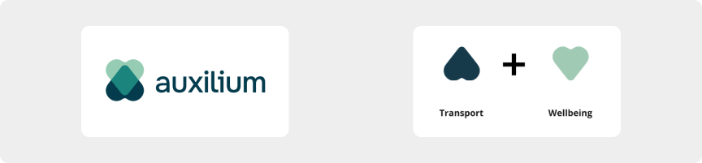
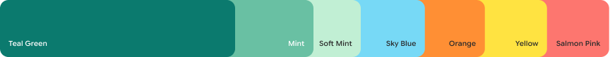
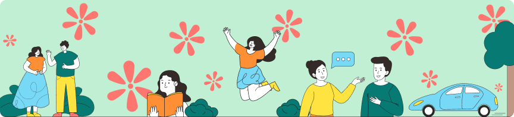
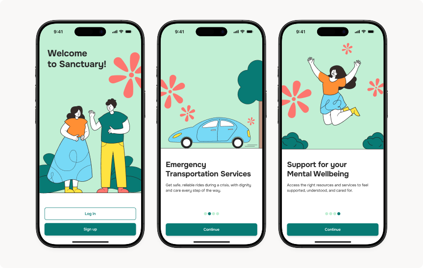
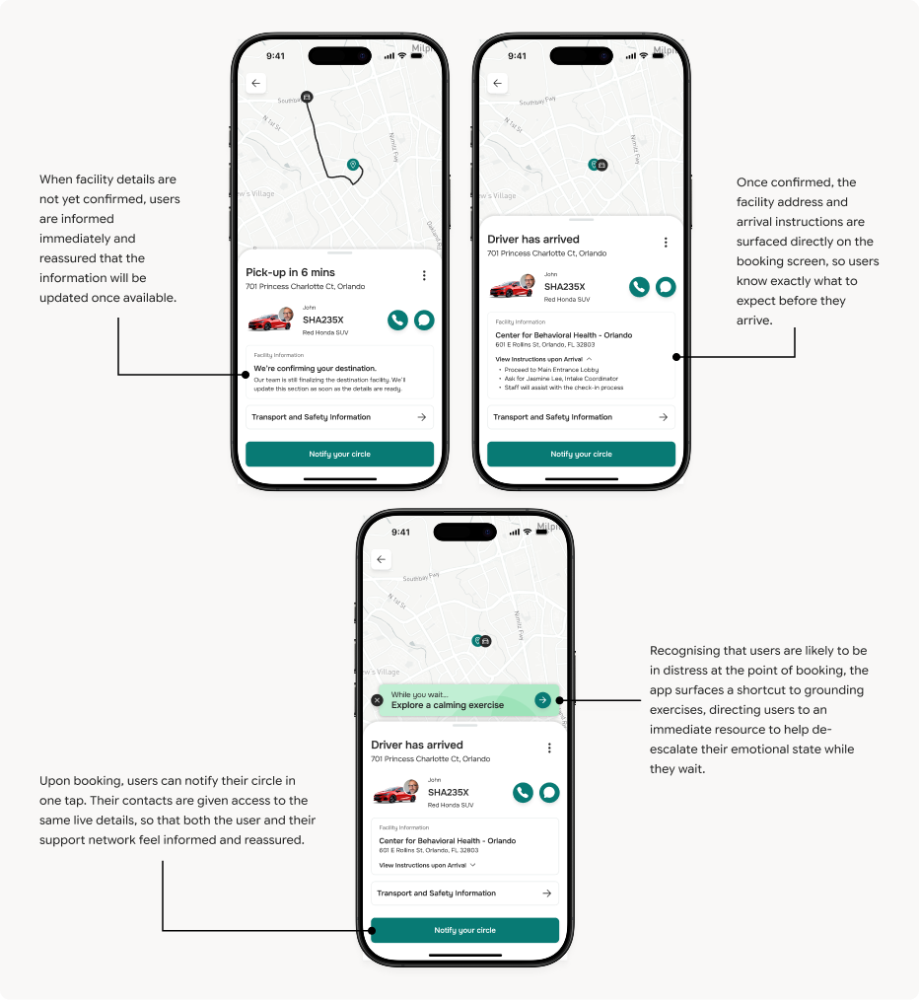
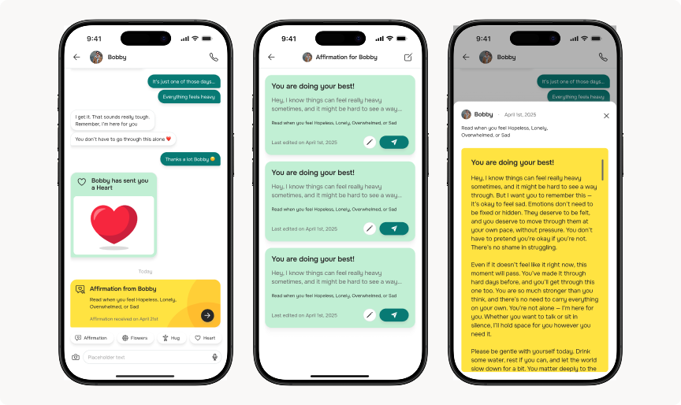
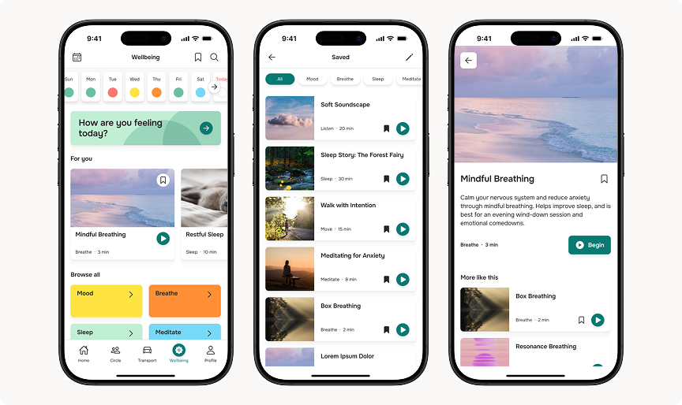
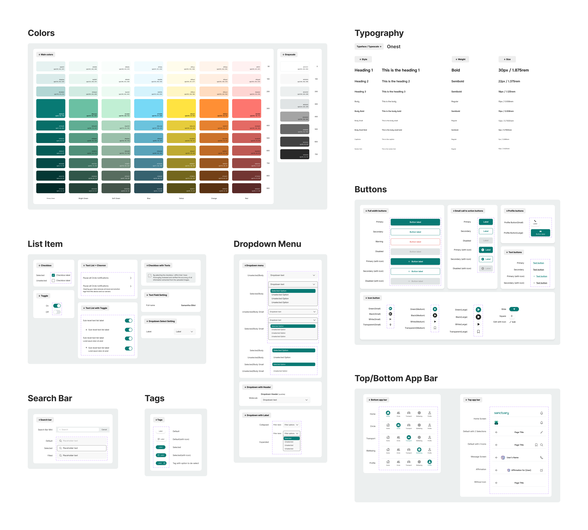

## Overview

When mental health crises occur, existing intervention protocols like the Baker Act allow for involuntary emergency detention and examination. While these protocols aim to safeguard people during triage, they often fail to preserve dignity and can exacerbate the very crisis they are meant to address.

Sanctuary* (*name changed due to client’s NDA)* reimagines mental health support as continuous, rather than fragmented. This is done through its feature offerings which takes care of its users’ wellbeing from their day-to-day lives, to critical moments when they need professional help.

- **Safe and Dignified Transportation Experience:** Booking of private transport service to mental health facilities with drivers trained with trauma-informed care
- **Mental Wellness:** Grounding exercises for users to build resilience daily and manage escalation during difficult moments
- **Chat and Call Function:** Allowing users to stay connected and share their personal updates with trusted contacts who are either their family or friends

## Outcomes

- A **complete redesign** of all three feature areas: transport booking, communication, and wellness
- A **new brand identity**: logo, color palette, illustration style, and typography
- A **style guide** delivered to the client's development team as a handover asset

<aside>
❗
**Note:** Sanctuary is currently pre-launch and in active crowdfunding. Design deliverables are complete but the product has not yet been built.

</aside>

## Challenges

The project had a few interconnected problems:

<aside>

#### **Missing Foundations**

- **Limited user** and **competitor insights** beyond client-provided background information
- **No brand identity** existed to guide the visual design
</aside>

<aside>

#### **Design Challenges:**

- Clients wanted Sanctuary to serve **two distinct user groups**: Those at **high risk of a mental health crisis** *(served by the transport feature)*, and a **broad audience** who are interested in managing their daily mental wellness *(served by the grounding exercises)*. These user groups have different needs and different contexts of app usage, and the **product has to meet both**.
- The **transport booking screens** had to complement a **service process** that the client had **not fully defined** yet, and formalizing that process was out of our scope.
</aside>

#### **Design Challenges:**

- Clients wanted Sanctuary to serve **two distinct user groups**: Those at **high risk of a mental health crisis** *(served by the transport feature)*, and a **broad audience** who are interested in managing their daily mental wellness *(served by the grounding exercises)*. These user groups have different needs and different contexts of app usage, and the **product has to meet both**.
- The **transport booking screens** had to complement a **service process** that the client had **not fully defined** yet, and formalizing that process was out of our scope.
</aside>

<aside>

#### **Existing Screen Designs:**

- Audit surfaced **major usability issues with existing screens** *(e.g. Incomplete flows, unclear screen sequences, inconsistent components)* which made them unsuitable as a foundation, and for usability testing
- We negotiated with the client for a scope change which they were agreeable to, and the **focus** of this project **shifted** from designing the new wellness feature and design system creation, to a **complete app redesign**, **rebrand** and a **style guide** for the client’s development team.
</aside>

## Approach

The design process was structured across four phases:

### Research

#### User Research

I segmented the research into two groups: users at high risk of a mental health crisis, and a broader low-risk audience, reflecting the client's two distinct feature goals. I conducted interviews with high-risk participants recruited by the client under NDA, and a combination of surveys and interviews with the low-risk group.

##### Insights from Users:

<aside>

**Transportation:**

- **Emotional and Physical Vulnerability:** Users facing a mental health crisis often experience intense emotional distress, isolation, and physical discomfort, making them less receptive to traditional emergency protocols
- **Need for Privacy and Dignity:** There is a strong preference for discreet, reliable transport that ensures safety without involving law enforcement or exposing users to stigma
- **Simplified Booking Process:** A fast, low-friction booking process is essential, coupled with clear, timely updates on the next steps after booking the transport to reduce uncertainty and anxiety while the user is distressed
</aside>

<aside>

**Communication:**

- **Mode of Communication:** Users prefer to initiate conversations about their mental health status in person or through voice/video calls, instead of via text messages
- **Communication Sensitivity:** Users prefer to have control over what they share, who they share it with, and when they share, to avoid causing themselves and their loved ones unnecessary stress
- **One Primary Support Contact:** While our initial design promoted a broad support circle, users consistently emphasised that they relied on a single trusted person in an event of a crisis
- **Receiving Support:** During a difficult period, both user groups enjoy receiving affirmations and positive support from family and friends, that makes them feel understood and valued
- **Emotional Bandwidth:** Users did not always have the capacity to initiate or sustain a conversation with their support contact when struggling, even when they wanted to feel supported
</aside>

<aside>

**Grounding Exercises:**

- **Need for Variety:** Preferred grounding exercises vary according to how users are feeling at the moment, which includes meditation, breathwork, soundscapes, etc.
- **Customizable Reminders:** While reminders can be helpful, they can also cause unwanted annoyance and stress towards users when too frequent or delivered in a pushy tone. Users wanted control over when and how often they receive these reminders.
</aside>

#### Competitor Research

<aside>

**Challenges** Sanctuary will face:

- **Competitors with established brand recognition:** Availability of non-emergency transportation services through well-known brands like Uber and Lyft, making them feel more credible compared to an emerging brand like Sanctuary.
- **Competitors’ offerings of mental wellness activities:** Apps like Headspace and Calm offer an extensive library of wellness resources, including guided meditations, breathwork, soundscapes, and sleep aids, that Sanctuary would need to match to compete for user engagement.
</aside>

<aside>

**Gaps** Sanctuary can fill:

- **Therapy Access:** Apps like BetterHelp and TalkSpace connect users with licensed therapists for virtual sessions. Sanctuary could build towards enabling the app to function as a shared treatment tools between users and their therapists (future opportunity as therapists aren’t part of the targeted user groups yet)
- **Mood Tracking & Journaling:** Apps like Moodfit and Happify use emotion logs to surface mood trends over time, a potential pattern Sanctuary could adopt to help users track emotional progress across the app's three features.
- **Service Request Flow:** Non-emergency transport services typically use web forms or booking dashboards for ride requests which might not be the easiest for users to navigate in an event of an emergency. Sanctuary could address this through an easy in-app booking flow designed for high-stress moments.
- **Transport is purely logistical:** Most non-emergency transport services focus on getting the user from point A to B, leaving the passenger’s emotional wellbeing and distress management unaddressed during the journey
</aside>

### Brand Design

#### Branding Workshop Findings

<aside>

**Brand Values**

Support, Care, Dependability

</aside>

<aside>

**Tone of Voice**

Caring, Empowering, Reassuring

</aside>

<aside>

**Brand Positioning**

Established, Friendly, Authoritative, Bright, Approachable

</aside>

#### Translating Brand Values to Visual Design

##### Logo Sketches

The logo combines two hearts, one representing wellbeing and the other a GPS arrow, to convey the message *'We are the way to your wellbeing’.*

##### Font Selection

Onest was selected for its readability and its balance of warmth and clarity, ensuring information lands quickly and consistently across every screen, particularly for users navigating the app under stress.

##### Color Palette

The primary palette centres on teal and mint green, chosen to embody the brand's core values of Support, Care, and Dependability. Green evokes calm and steadiness, the visual equivalent of a reassuring, reliable presence. Secondary colors are bright and warm, adding an approachable and uplifting quality that counters the clinical coldness associated with traditional mental health services. Together, they reflect a brand that is grounding without being heavy, and supportive without being sterile.

## Final Designs

### App Design

#### Emotional Design

Onboarding screens use **warm, inviting illustrations** and a **reassuring tone of voice** to create a welcoming first impression, encouraging users to create an account while **establishing confidence** that they will be well supported.

#### Transport

Our research reflected **uncertainty** as one of the lead causes of stress when users go through the process of getting help at a facility. Hence, the transport experience was designed around **removing that uncertainty at every step of the booking process**.

#### Sending Affirmations, apart from regular text messages

While designing the messaging feature, we recognized that users **did not always have the capacity** to initiate or sustain a conversation when they were struggling. At the same time, they **wanted to feel supported** by their loved ones **without burdening them** with the details of what they were going through. Sanctuary's communication feature needed to offer something that resolved this dilemma **without requiring users to initiate a conversation** at all.

The **Affirmations** feature allows users and their circle to **send pre-written messages** of support to be **read at a specific emotional moment**, for example when the recipient indicates they are feeling low.

Whenever the user **indicates in the Mood tracking feature** that they are **feeling upset**, Sanctuary will also **prompt the user to read an affirmation** sent by their circle.

#### Wellness Feature

**Mood tracking** adds a layer of personalisation, linking the user's emotional state to relevant exercise suggestions and affirmation prompts, making the app more intuitive with each use.

Add screenshots here

Add screenshots here

We also designed a **flexible component library** to support a wide range of exercise formats, including videos, podcasts, audio, and articles, giving the client the flexibility to expand their content offerings over time.

#### Style Guide

As part of our handover, we developed a style guide to ensure visual and interaction consistency across Sanctuary's interface beyond our involvement. It covers color, typography, iconography, spacing, and a component library, giving the client's development team a clear reference to build from and a foundation for any future design work.

## Reflections

Most of my design work has been focused on measuring success by efficiency and task completion. Sanctuary was the first project where success meant something different, where success looks like designing an experience that makes users feel supported and safe. Hearing directly from users about what they go through during a mental health crisis made me aware of the real impact my designs could have on them. It pushed me to be far more deliberate about designing responsibly and ethically, knowing that a poorly executed solution could do more harm than good. I wanted my design decisions to convey the support, care and compassion that they need most in times of crisis through the application.

What I am really proud of is being able to bind the three features as one cohesive experience. My favourite feature is the Affirmations feature, as it represents the kind of experience I set out to create as a designer. I want to design features that not just exist for the sake of setting the app apart from other competitor’s products, but the feature should be meaningful and value-adds to the needs of users. A user in crisis being able to write an affirmation for someone they love, and receive one in return, is something no competitor in this space currently offers.

#### What I would have done differently

I would have time boxed the user recruitment window with our client, agreeing upfront that delays would trigger a pivot to alternative research methods (e.g. Interviewing therapists and psychiatrists)

I also would have protected time for usability testing at the end. Several design decisions were made based on research insights but remain unvalidated with real users. For a product serving users experiencing a mental health crisis, we need to have an even better grasp of what our users are experiencing and if our interventions are truly helpful. 

If I were to conduct a round of usability testing, these would be my research objectives:

**R1:** What information do users need at each stage of the transport journey, and does surfacing it progressively help reduce anxiety or add to it?

**R2:** Do users in distress have the emotional bandwidth to engage with grounding exercises while waiting for transport, and while in the transport?

**R3:** Would users find value in the affirmations feature? Would receiving affirmations from their circle provide the emotional support it was designed to deliver?
