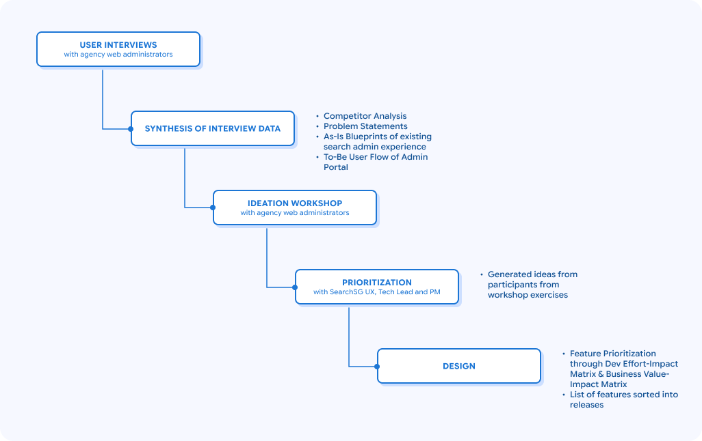
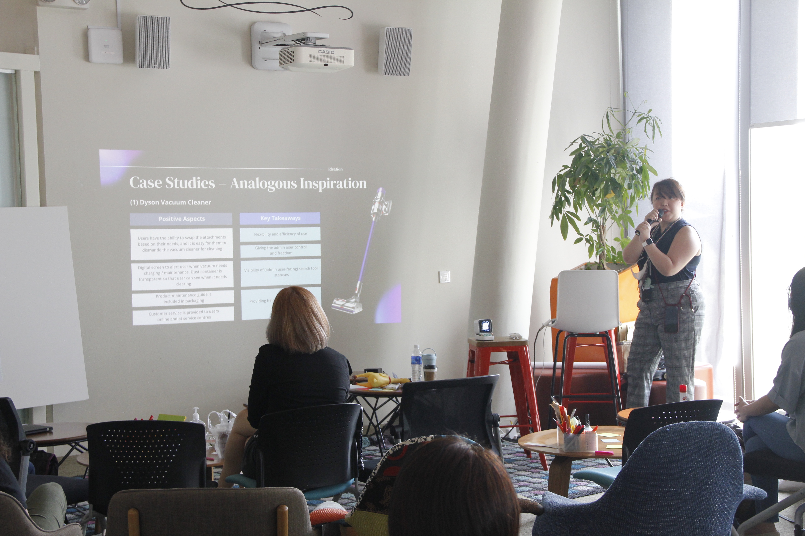

## Overview

SearchSG is the Singapore government’s search engine that aims to improve the effectiveness and efficiency for finding any government-related information and services. As more government agencies onboarded SearchSG as their website’s search tool, we identified an increasing demand to build an administrative portal to allow automated onboarding, search configuration and the provision of search insights for our potential administrative users, who are the webmasters from the government agencies.

I joined the SearchSG product team as a **UX researcher** when the agency user interviews had been completed but mid-way through the synthesis phase. My work covered the **synthesis of that research**, the **planning and facilitation of an ideation workshop** with agency representatives, a **prioritisation exercise** with the product team, and the **design of the portal's login and access control screens**.

## Outcomes

- The creation of SearchSG’s Administrative Portal allowed all 308 onboarded agencies, for the first time, to **have direct control over their search configuration** and have **direct access to their search analytics** *(data as of May 2026)*
- Through the portal, the SearchSG team is also able to have greater visibility over monitoring the number of agencies that onboarded, and the level of usage of various SearchSG features)

## Challenges

Before SearchSG existed, most agencies were using Google Custom Search or the existing search bar provided by Isomer *(a Singapore Government website builder tool)* as it were the easiest ways to add search functionality to their sites. A few agencies were using vendor provided CMS tools to power their search experiences. However, there were limitations to the existing search solutions:

- Agencies **could not configure** their search bar
- Google Custom Search **served advertisements within results** that agencies had no way to remove
- Most agencies had **no access to search analytics**
- Existing CMS tools used by agencies *(e.g. Lucidworks, Sitecore, Sitefinity)* offered more control in theory but **brought integration problems and vendor dependency**
- Agencies had **no way to bump up pages** in their search results, especially during specific seasons (e.g. Tax season when there is a spike in tax filing guidance search queries)

We also noticed **most agencies were new to the idea of managing and improving their search experience**.

- 8 out of 9 agencies interviewed had no KPIs for search
- 5 out of 9 agencies interviewed had no idea how a well-managed search experience would benefit their website’s user experience
- Only 1 out of 9 agencies had conducted research on how citizens used their site’s search function

Thus, the administrative portal had to be designed not only for agencies to make basic configurations to their search tool, but also to guide agencies on how to meaningfully utilize the search insights provided to them to improve their site’s search experience.

## Approach

Before building SearchSG’s administrative portal, we wanted to understand the pain points agency website owners faced in managing search tools and work closely with them to craft the ideal experience for them. We conducted user interviews and held an ideation workshop with representatives from various government agencies’ web teams before prioritizing and landing on the list of features to include in the first version of the administrative portal.  

### Synthesis of User Interview Data

As I joined the team after interviews were conducted, I had to rely on recordings and my UX Lead (who conducted those interviews) to understand the context of the verbatims collected.

I created the following artifacts based on data extracted from the user interviews:

- **Competitor analysis** across the existing search solutions used by agencies, to discover any gaps and opportunities SearchSG could fill
    - Strengths, Weaknesses of existing search solutions → Based on interview insights with agency representatives
    - Speed, Search Relevance and Accuracy, Level of Customisation, User Facing Search Features, Admin Facing Search Features, Search Analytics Related Features
    - Search solution features used by agencies and their pain points w.r.t. those features
- Two separate **As-Is blueprints** of how agencies manage their search experience, one for agencies using Isomer and the other for agencies using other tools
    - The decision to create two As-Is blueprints rather than one came from noticing that a large number of agencies were hosting their website on Isomer as it was soon-to-be mandated that all government agencies onboard to Isomer. Also, agencies using Isomer had different pain points, setup processes, and constraints, compared to agencies who are not.
- **To-be user flow** based on opportunities drawn from competitor analysis and the As-Is blueprints, to chart what an improved search administrative experience could look like

My UX Lead and I also **condensed the interview insights** into two **How Might We (HMW) statements**, that were later used in our ideation workshop as brainstorming questions:

<aside>

How might we **empower** admin users to **configure** search relevance, filters, and the results page **easily**?

</aside>

<aside>

How might we enable agencies to **view search insights** that are **meaningful**, **actionable**, and **easily understandable**?

</aside>

### Ideation Workshop

I designed and facilitated a half day workshop with 21 participants from 3 agencies who have had past experiences managing their search experience. The artifacts I created from the synthesis phase was also shared during this workshop to keep participants informed of the difficulties they face in their current experience of managing their search experience, as well as 

I structured the workshop in three phases to scaffold the brainstorming activities for participants as it was mostly everyone’s first time participating in an ideation session.

**Brainstorming activities** were split into:

<aside>
💡
<h4>Generate</h4>

<b>Crazy 8</b> and dot voting to encourage volume of ideas and divergence

</aside>

<aside>
🔍

#### Evaluate

**SCAMPER method** and a **gallery walk** to pressure-test and refine ideas

</aside>

<aside>
✅

#### Finalise

**Storyboarding** to visualize how the strongest ideas would actually function

</aside>

From this ideation workshop, we could tell that users wanted a **high level of automation** so that the search administration and maintenance process could be fuss-free. They also wanted something similar to Squarespace or Wix where any **customizations they made to the search bar and search results page could be seen live**.

## Prioritization and Design

We **assessed** each feature that was planned for the administrative portal against **design and** **development effort, business value, insights** from user interviews and the ideation workshop, then mapped them to release phases before we started on the screen designs.

For the first release, I designed:

- Login screens, using government email authentication connected to the existing Whole-of-Government user database
- Access control screens, modeled after WOGAA’s (Whole of Government Application Analytics) access controls since most agency webmasters already were familiar with their interface
- A permissions matrix covering the different user roles and access levels the portal needed to support

<aside>
❗

Designs cannot be publicly displayed due to confidentiality agreements with the client. However, I'd be happy to show and walk through it during interviews.

</aside>

## Impact

As of May 8 2026, 308 agencies have onboarded to SearchSG and are also using the administrative portal to configure their site’s search experience. Compared to the past where most agencies could only utilize basic features from the free tier of search services, they can now make more **customizations** to their search feature to improve the browsing experience of citizen users on their website, and also **access search analytics** that could help with informing how agencies would like to tune their search.

Through the various engagement sessions we had with agency users (interviews and ideation workshop), we also got to promote the importance of search maturity on government websites. With the number of agencies onboarded since 2023 (10) to now (308), it is a testament to SearchSG’s efforts that more agencies are viewing their site search’s experience more seriously.

## Reflections

Joining a project halfway through was a huge challenge, as I had to play catch up to get up to speed with my understanding of the interview insights, while I lacked the context behind the verbatims as I was not physically present at the interview sessions. I had to rely heavily on the recordings available which were not always clear. However, I pulled through with a lot of help and guidance from my UX Lead who provided me with context and insights that I could not derive through the recordings and interview transcriptions.

Through this project, I gained a lot more knowledge on synthesising research data. I was new to crafting problem statements, as my previous team went straight from creating category headers in our Affinity Mapping, to crafting How Might We statements. I faced a lot of pushback from my UX Lead on my first attempts of crafting such statements, and her critique helped me understand the difference between a statement that describes a symptom and one that names the root cause. Writing a problem statement of good quality does affect the quality of the ideas generated from it. I emerged from this research project feeling more confident of crafting problem statements that reflects the root cause of the problem.