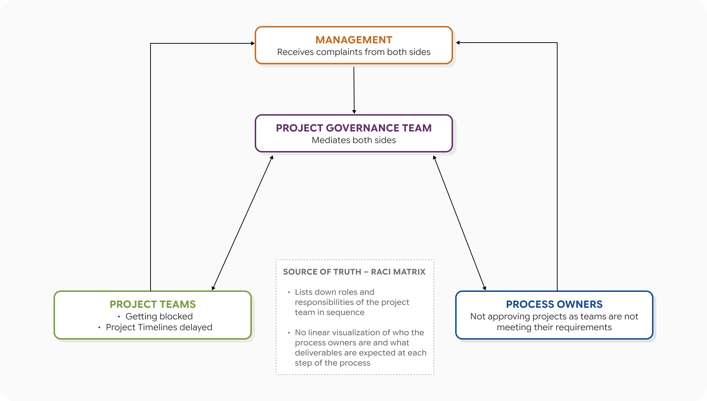
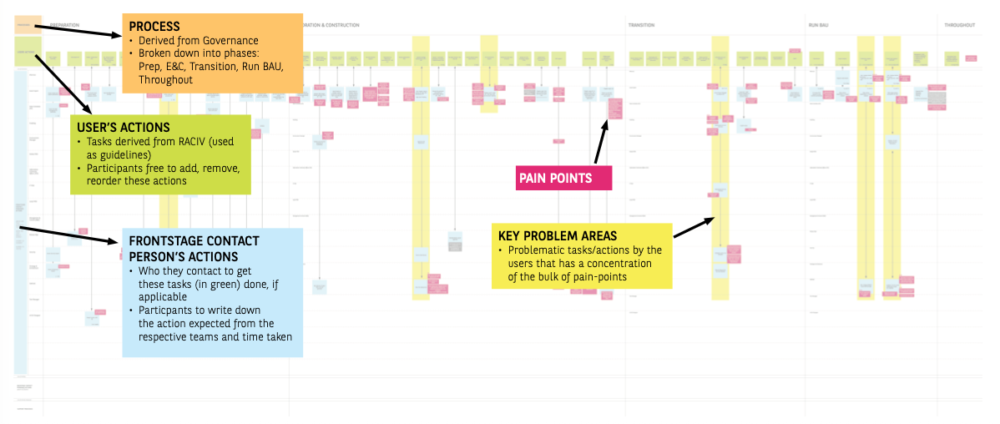

## Overview

Historically, there has been a constant stream of complaints on the ground about the **long** and **painful project delivery journey** in the IT department of a financial services organization, where **stringent compliance requirements** and **legacy systems** made every delivery checkpoint difficult for project teams to clear. There was also **no official process defined** and documented for project teams to follow, other than a RACI matrix to map out roles and responsibilities for tasks.

Seizing the opportunity of an ongoing IT Transformation initiative, I investigated the current delivery journey by conducting **12 role-specific Service Design Blueprinting workshops** with developers, business analysts, project managers, scrum masters, tech leads and testers from the **Singapore and Chennai offices**, to **improve the project teams' experience of delivering a project**.

## Outcomes

I merged the role-specific blueprints to form the organization’s **first official delivery journey map**, which greatly helped the project governance team and management to **visualize the end-to-end journey** across all six project team roles, and the supporting teams *(e.g. Security, Compliance, Strategy & Architecture)* that owned different parts of the process. It also allowed them to **pinpoint exactly where pain points and bottlenecks occurred** in the process, and which teams were involved at those points.

From there, I also utilized the delivery journey map to:

- Identify **gaps** between the roles and responsibilities ****documented on the RACI matrix, and what was being done on the ground
- Guide the project governance team to **update our official process documentation** and **remove obsolete tasks** on the RACI matrix
- Surface **pain points** that project teams were experiencing in the delivery journey to management, where we evaluated and prioritized these pain points together

These findings also kicked off a ground-up problem solving initiative known as “Change Angels”, which will be covered in a later section.

## Challenges

- **No end-to-end visualization** of the project delivery journey that the Project Governance Team could use to align expectations of Project Teams and Process Owners with
- RACI Matrix documented responsibilities of each project team role sequentially, but **not dependencies** or **which Process Owners** they had to liaise with at different points of the delivery journey
- Management was receiving complaints from both Project Teams and Process Owner, but **no way to verify either accounts** and **identify specifically where the process breakdowns were actually happening**
- **Informal workarounds had accumulated** over time to the point where there was **no consistent delivery process followed** across teams

## Approach

## Adapting the blueprint to our organization's context

A mixed method study consisting of surveys, focus group discussions, contextual inquiry and service design blueprinting was initially proposed to management. After considering the budget and timeline allocated for this study, I decided to proceed with a **Service Design Blueprinting** Workshop done in the form of a focus group discussion.

Service Design Blueprinting was chosen because it was the only method that could simultaneously capture the following:

- **Sequence** of the delivery journey
- **Dependencies** between the project team and process owners at each step
- **Jobs to be done** by project teams
- **Pain points** experienced by project teams

I **adapted** the standard service design blueprint format in two ways:

- I **pre-populated the User’s Actions row** [Green color] with each role’s **responsibilities taken from the RACI matrix** instead of getting the participants to list it down. Participants could remove tasks they no longer did, reorder them, or add tasks that weren't in the RACI at all.
- I expanded the Frontstage Actors section [Blue color] to include all 21 process owners, so participants could map exactly which **owners** they **interact with** at each step, and the **nature** and **duration** of those interactions *(e.g. meetings, tasks)*
- Small pink post-its are used to capture **pain points** tied to specific tasks or interactions

## Executing the workshops

The blueprinting workshops were first piloted in the **Singapore and Chennai offices** across 7 sessions for each of the roles in the project teams: Developers, Technical Leads, Scrum Masters *(for Agile Projects)*, Project Managers *(for Waterfall Projects)*, Business Analysts, Testers, Division Heads

As the **management saw immense value in these blueprinting workshops** from the Singapore office pilot's findings, I was then sent to the Chennai office to continue with conducting 6 more blueprinting sessions as there were many project team members based there too.

## Synthesis

The blueprint was then evaluated from three key areas:

  

    <h4 style="font-size: 11px; font-weight: 600; margin-bottom: 12px; text-transform: uppercase; letter-spacing: 0.08em;">Process</h4>
    <ul style="list-style: none; padding: 0; margin: 0;">
      <li style="font-size: 13px; color: var(--ink-muted); line-height: 1.7; padding: 4px 0 4px 16px; position: relative;">I identified any <strong>inconsistencies</strong>, <strong>obsolete tasks</strong>, and <strong>steps</strong> being done in a <strong>different order</strong> from what was documented in the RACI</li>
    </ul>
  

  

    <h4 style="font-size: 11px; font-weight: 600; margin-bottom: 12px; text-transform: uppercase; letter-spacing: 0.08em;">Workload</h4>
    <ul style="list-style: none; padding: 0; margin: 0;">
      <li style="font-size: 13px; color: var(--ink-muted); line-height: 1.7; padding: 4px 0 4px 16px; position: relative;">I documented the <strong>full scope of responsibilities</strong> carried by <strong>each role</strong>, including <strong>work not captured in the RACI</strong></li>
      <li style="font-size: 13px; color: var(--ink-muted); line-height: 1.7; padding: 4px 0 4px 16px; position: relative;">I identified if there were any <strong>capacity issues</strong>, and where in the process was that most likely to occur, as that has been a recurring complaint to management</li>
    </ul>
  

  

    <h4 style="font-size: 11px; font-weight: 600; margin-bottom: 12px; text-transform: uppercase; letter-spacing: 0.08em;">Interactions</h4>
    <ul style="list-style: none; padding: 0; margin: 0;">
      <li style="font-size: 13px; color: var(--ink-muted); line-height: 1.7; padding: 4px 0 4px 16px; position: relative;">I analysed the <strong>nature</strong> of the <strong>interactions</strong> between project teams and process owners <em>(type of interaction, what was expected from each party, length of interaction, pain points if any)</em></li>
    </ul>
  

## Impact

Besides what we sought out to identify in the synthesis process, the blueprint also surfaced findings that we were not expecting to discover:

  

    <h4 style="font-size: 11px; font-weight: 600; margin-bottom: 12px; text-transform: uppercase; letter-spacing: 0.08em;">Process</h4>
    <ul style="list-style: none; padding: 0; margin: 0;">
      <li style="font-size: 13px; color: var(--ink-muted); line-height: 1.7; padding: 4px 0 4px 16px; position: relative;">Many <strong>tasks were happening simultaneously across roles</strong> within the <strong>same project phase</strong>, which was not reflected in the RACI</li>
      <li style="font-size: 13px; color: var(--ink-muted); line-height: 1.7; padding: 4px 0 4px 16px; position: relative;">Led to team members taking on responsibilities that weren't formally theirs, <strong>increased workload</strong>, and <strong>bottlenecks</strong> in the process</li>
      <li style="font-size: 13px; color: var(--ink-muted); line-height: 1.7; padding: 4px 0 4px 16px; position: relative;">Some tasks were being <strong>executed in a different sequence</strong> from what was documented, suggesting process changes had been made over time without the RACI being updated</li>
    </ul>
  

  

    <h4 style="font-size: 11px; font-weight: 600; margin-bottom: 12px; text-transform: uppercase; letter-spacing: 0.08em;">Workload</h4>
    <ul style="list-style: none; padding: 0; margin: 0;">
      <li style="font-size: 13px; color: var(--ink-muted); line-height: 1.7; padding: 4px 0 4px 16px; position: relative;">Project teams were <strong>simultaneously managing multiple project milestones across different phases</strong>, each with its own process owner requirements, while also maintaining BAU responsibilities</li>
      <li style="font-size: 13px; color: var(--ink-muted); line-height: 1.7; padding: 4px 0 4px 16px; position: relative;">Process Owner teams were also experiencing <strong>bandwidth issues</strong> as they were very lean, with as few as <strong>two to five people</strong> responsible for validating submissions from all active project teams in the organisation</li>
    </ul>
  

  

    <h4 style="font-size: 11px; font-weight: 600; margin-bottom: 12px; text-transform: uppercase; letter-spacing: 0.08em;">Interactions</h4>
    <ul style="list-style: none; padding: 0; margin: 0;">
      <li style="font-size: 13px; color: var(--ink-muted); line-height: 1.7; padding: 4px 0 4px 16px; position: relative;"><strong>Turnaround times</strong> from process owners were <strong>highly inconsistent</strong>, ranging from days to as long as four months</li>
      <li style="font-size: 13px; color: var(--ink-muted); line-height: 1.7; padding: 4px 0 4px 16px; position: relative;">Once project teams handed off deliverables to process owners, there was <strong>no visibility into progress, nor Service Level Agreements</strong> governing how quickly process owners were expected to resolve blockers, making it impossible to anticipate delays or follow up effectively</li>
      <li style="font-size: 13px; color: var(--ink-muted); line-height: 1.7; padding: 4px 0 4px 16px; position: relative;">Process owners were also <strong>slow to respond to requests</strong>, with some taking more than a month to get back to project teams</li>
    </ul>
  

## Next steps

## Prioritization with managers

As the blueprinting workshops surfaced a large number of pain points *(293 of them)*, I held a **prioritization session with management** and the project governance team where we sorted pain points based on its level of impact *(on the delivery journey and organization)* and level of difficulty *(to resolve it)*.

**Pain points** that emerged as high impact and low to mid level of difficulty to resolve were shortlisted to be **transformed into problem statements** for the organization's new **Change Angels** initiative, while the other pain points were stored in the Project Governance team's backlog to be tackled in the future.

## Change Angels

Change Angels is a **ground-up initiative** that involves volunteers from various departments **collaborating cross-functionally to solve company wide issues** using the design thinking process. I was involved in this initiative as part of the organizing team, and I also facilitated one of the volunteer teams' weekly meetings.

In the first season of Change Angels, 3 of the pain points filtered from the blueprinting workshops were made into problem statements for 3 volunteer teams to resolve over the span of 2 months. One of the biggest pain points was the lengthy time taken for project teams to complete tasks listed in the Go-Live Checklist for teams to push their project into production because the requirements were not specific and it was difficult to locate the checklist in the company's internal drive.

The team that I facilitated **successfully managed to create and launch** a Sharepoint page titled MAPLE *(Make A Project Life Easier)* that **centralizes the location** of all the checklists *(including the Go-Live Checklist)* that project teams have to fill up in their project delivery journey, and also **provides explanations for requirements that were previously unclear**. MAPLE has evolved into one of the beloved products owned by the project governance team, and it is **still being used by the organization today, more than 5 years later**.

There were many who were skeptical about ground-up initiatives in the organization, as Change Angels was not the management's first attempt at it. However, the success of my team and the support they got from management to launch the solution **gave everyone in the organization confidence** that ground-up initiatives are actually **possible** and **effective**.

## Reflections

This was a very meaningful project to me as it was the first time the organization tried a bottom up approach to problem-solving, and also my first time experimenting with the use of Service Design Blueprints as a user research method. I received a lot of positive feedback from the workshop participants that this is a rare opportunity for many of them to highlight the critical pains that they face in their daily work to the management.

In organizations that are new to user experience design, it is common for us UX designers to have to make customizations to the theoretical user research methodologies in order to achieve the objectives we would like to get from our engagements with the users. This taught me the importance of being adaptive and flexible with my UX Research knowledge to fit it to the context of the organization I'm in.
